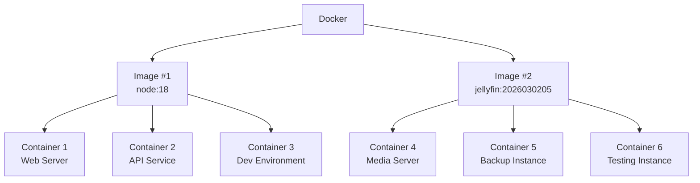

---
linkTitle: Docker
---


&nbsp;

# What is Docker?
> Docker packages your application and everything it needs — code, dependencies, configuration — into a portable container 
> that runs the same way everywhere.

&nbsp;

## Core Components

Docker is built around two concepts: **images** (the blueprint) and **containers** (the running instance). 
You build or pull an image, then run containers based on that image (or variations of it).

Example:

&nbsp;

## Installing Docker


&nbsp;


## Finding & Creating Images

### Prebuilt Images

You can browse through [Docker Hub](https://hub.docker.com) for pre-built images. 
There are hundreds of options to choose from.


Some key commands you should know: 

| Command                  | Purpose                                                                              |
|--------------------------|--------------------------------------------------------------------------------------|
| `docker pull <image>`    | downloads the image to your machine                                                  |
| `docker build .`         | builds an image based on your `Dockerfile`                                           |
| `docker run <image>`     | downloads the image *if* you don't have it, then launches a container                |
| `docker run -it <image>` | downloads the image *if* not already, runs interactive session from inside container |
| `docker ps`              | shows all active containers                                                          |
| `docker ps -a`           | shows all inactive **or** active containers                                          |


> [!TIP]
> You may see something like `docker pull node:trixie-slim` instead of just `docker pull node` - this is because 
> you can specify versions of the image you intend to work with.
> 

Prebuilt images cover most common runtimes and tools. You'll want to build your own when you need to package your actual application code.

###  Building Custom Images

A `Dockerfile` is a plain text file with step-by-step instructions Docker uses to build your image.












```Docker {filename=Dockerfile_Example}
# Pulls in your selected image
FROM node:18

# Sets the working directory
WORKDIR /app

# Dictates what files are copied & where they're copied to inside the image
COPY . /app

# Node.js specific, installs dependencies
RUN npm install

# Tells Docker what port to expose
EXPOSE 80

# Runs Container
CMD ["node", "server.js"]
```

> [!NOTE]
> `EXPOSE` is declarative — it documents the intended port but doesn't publish it. To actually map it, use `-p 8080:80` 
> when running the container.

&nbsp;

### Attached versus Detached Mode

When running Docker containers, you have the option of attached or detached mode. Attached mode keeps the container running inside 
the terminal, displaying console logs in real time. Detached mode runs the container in the background so you can 
continue using the terminal. 

Use `docker ps -a` to list all active/inactive containers, then collect the name or ID of 
your container (both work in place of `<image>` below)

To run in attached mode: `docker run -p port:port <image>` or `docker start -a <image>`

To run in detached mode: `docker start -p port:port <image>` or use the `-d` flag `docker run -p port:port -d <image>`

To stop a container: `docker stop <image>`

To attach yourself to an already running container: `docker attach <image>`

> [!TIP]
> Use `docker --help` to see a full list of commands. You can also check the help menu options relative to the command with something 
> like `docker run --help` to display all command/flag options for `docker run`


